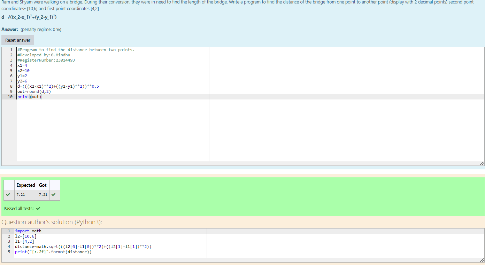

# DISTANCE-BETWEEN-TWO-POINTS

## AIM:
To write a python program to find the distance two 2 points
## ALGORITHM:
### Step 1: 
Get the two values from the user
### Step 2:
Assign the value of second variable to a temporary variable
### Step 3: 
Substitute the values in the distance formula  
### Step 4:
Assign the value in temporary variable to the first variable
### Step 5: 
Print both the values it would be interchanged
### PROGRAM:
  ```
# Program to find the distance between two points.
# Developed by:G.Hindhu 
# RegisterNumber:23014493
x1=4
x2=10
y1=2
y2=6
d=(((x2-x1)**2)+((y2-y1)**2))**0.5
out=round(d,2)
print(out)
  ```
### OUTPUT:

### RESULT:
Thus the distance between two points are successfully executed.
